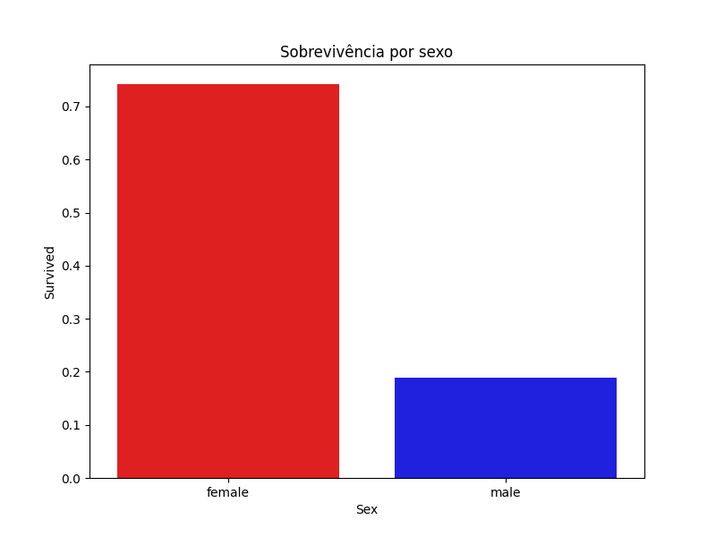
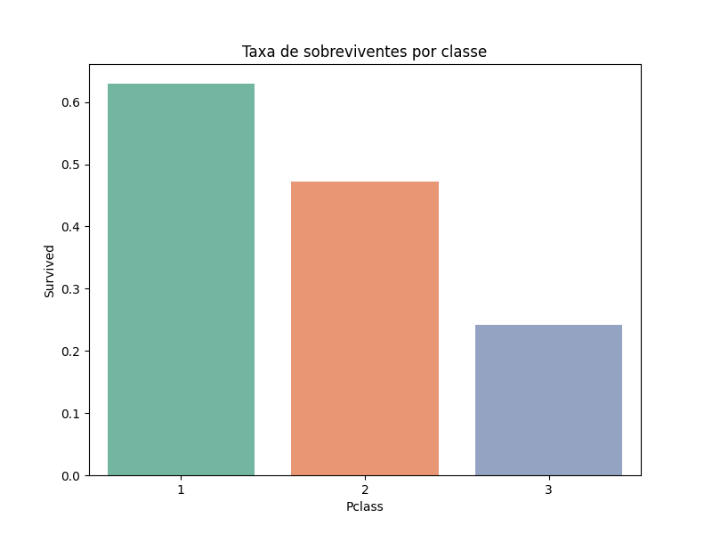
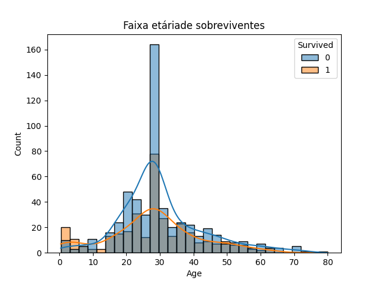

#  Análise Exploratória de Dados – Titanic

## 1️⃣ Objetivo

Este desafio tem como objetivo realizar uma Análise Exploratória de Dados (AED) utilizando a base pública do Titanic, com o intuito de compreender o comportamento das variáveis e identificar fatores associados à sobrevivência dos passageiros.

Para o desenvolvimento da análise, foi utilizada a linguagem de programação **Python**, juntamente com bibliotecas voltadas para manipulação de dados (**Pandas**) e visualização de dados (**Seaborn** e **Matplotlib**).

---

## 2️⃣ Compreensão dos Dados

O conjunto de dados foi importado em formato CSV e analisado para a compreensão de sua estrutura, verificando os seguintes aspectos:

- Tipos de dados;
- Estatísticas descritivas;
- Valores nulos;
- Dados duplicados.

Essa etapa permitiu avaliar a qualidade dos dados e identificar necessidades específicas de tratamento antes da análise exploratória.

---

## 3️⃣ Tratamento de Dados

Durante a preparação dos dados, foram realizadas as seguintes etapas com o objetivo de preservar o máximo de informações:

- Remoção de registros duplicados;
- Substituição dos valores nulos da variável **Age** pela mediana;
-Criação de uma variável **Child** classificando < 12 anos como **True** e **False** para > 12 anos como adultos;
- Substituição dos valores ausentes da variável **Cabin** por **"Unknown"**;
- Preenchimento dos valores nulos da variável **Embarked** pelo valor modal (mais frequente).

---

## 4️⃣ Análise Exploratória

### 🔹 Sobrevivência por Sexo

**Descrição:**

A taxa de sobrevivência foi significativamente maior entre o sexo feminino quando comparado ao sexo masculino. Observa-se uma taxa superior a 70% de sobrevivência entre as mulheres, enquanto entre os homens a taxa ficou abaixo de 20%.  

Esse resultado sugere que o gênero foi um dos principais fatores associados à sobrevivência dos passageiros.

---

## 🔹 Sobrevivência Crianças x Adultos

**Descrição:**

A análise indica que passageiros classificados como crianças (< 12 anos) apresentaram taxa de sobrevivência superior à dos adultos, esse resultado reforça o contexto histórico no qual a prioridade no processo de evacuação era direcionada a mulheres e crianças. Entretanto, é importante destacar que a idade não foi o único fator determinante, uma vez que aspectos como classe social também exerceram influência significativa nas chances de sobrevivência.
---

### 🔹 Sobrevivência por Classe

**Descrição:**

Ao analisar a taxa de sobrevivência por classe social, observa-se que os passageiros da **1ª classe** apresentaram maior probabilidade de sobrevivência, seguidos pela **2ª classe**, enquanto a **3ª classe** demonstrou a menor taxa de sobrevivência.

Esse padrão indica uma possível relação entre condição socioeconômica e chances de sobrevivência.

---

### 🔹 Distribuição de Idade por Sobrevivência

**Descrição:**

O gráfico mostra que a maior concentração etária dos passageiros estava entre 20 e 40 anos. Observa-se que a sobrevivência não depende exclusivamente da idade, porém há indícios de maior taxa de sobrevivência entre crianças e adultos abaixo dos 40 anos.

---

## 🎯 Conclusão

Após a análise exploratória dos dados, conclui-se que:

- Mulheres apresentaram maior taxa de sobrevivência;
- Passageiros da 1ª classe tiveram maiores chances de sobreviver;
-Crianças apresentaram maior probabilidade proporcional de sobrevivência;
- A maioria dos sobreviventes estava concentrada na faixa etária entre 20 e 40 anos;
- Fatores sociais e estruturais, como gênero e classe e idade, podem ter influenciado diretamente a sobrevivência dos passageiros.
